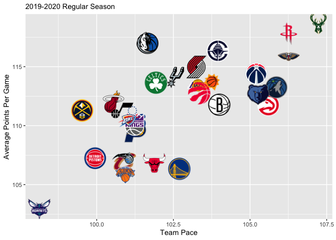
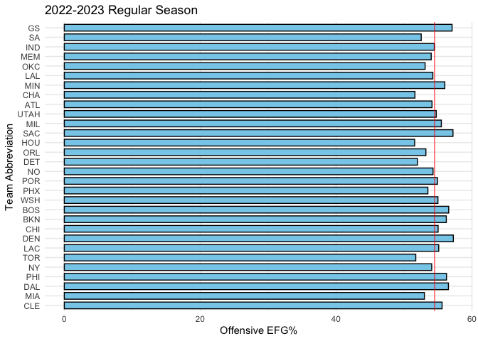

Pacing to Victory: Unraveling the Relationship Between Pace and Winning
================

# Loading Packages

This code will load some packages to help us retrieve NBA data from
ESPN’s API that will be used to generate visualizations.

``` r
devtools::install_github(repo = "saiemgilani/hoopR") 
pacman::p_load(tidyverse, hoopR, cowplot, ggimage, ggplot2, dplyr)
knitr::opts_chunk$set(echo = TRUE)
```

# Exploring NBA Pace Data

Using hoopR, tidyverse, and related libraries, we visualize each team's pace factor (possessions per game) against their average points scored, as well as effective field goal percentage (eFG%). Scatter plots for each season illustrate the relationship between a team's playing speed and offensive output.

``` r
# 2023 
regteams23 <- list()
for (id in 1:30) {
  reg23 <- espn_nba_team_stats(team_id = id, year = 2023, season_type = "regular", total = FALSE)
  regteams23 <- c(regteams23, list(reg23))
}
regpace23 <- do.call(rbind, regteams23)

postteams23 <- list()
postids <- c(1, 2, 5, 7, 9, 12, 13, 14, 15, 16, 17, 18, 20, 21, 23, 29) 
for (id in postids) {
  post23 <- espn_nba_team_stats(team_id = id, year = 2023, season_type = "postseason", total = FALSE)
  postteams23 <- c(postteams23, list(post23))
}
postpace23 <- do.call(rbind, postteams23)

# 2022
regteams22 <- list()
for (id in 1:30) {
  reg22 <- espn_nba_team_stats(team_id = id, year = 2022, season_type = "regular", total = FALSE)
  regteams22 <- c(regteams22, list(reg22))
}
regpace22 <- do.call(rbind, regteams22)

# 2021
regteams21 <- list()
for (id in 1:30) {
  reg21 <- espn_nba_team_stats(team_id = id, year = 2021, season_type = "regular", total = FALSE)
  regteams21 <- c(regteams21, list(reg21))
}
regpace21 <- do.call(rbind, regteams21)

# 2020
regteams20 <- list()
for (id in 1:30) {
  reg20 <- espn_nba_team_stats(team_id = id, year = 2020, season_type = "regular", total = FALSE)
  regteams20 <- c(regteams20, list(reg20))
}
regpace20 <- do.call(rbind, regteams20)
```

``` r
# 2023
regpace23 %>% 
  ggplot(aes(x = offensive_pace_factor, y = offensive_avg_points)) +
  geom_image(aes(image = logo_href), size = 0.12) +
  labs(x = "Team Pace", y = "Average Points Per Game", subtitle = "2022-2023 Regular Season") + 
  theme(legend.title = element_blank())
```

<!-- -->

``` r
postpace23 %>% 
  ggplot(aes(x = offensive_pace_factor, y = offensive_avg_points)) +
  geom_image(aes(image = logo_href), size = 0.12) +
  labs(x = "Team Pace", y = "Average Points Per Game", subtitle = "2022-2023 Postseason") + 
  theme(legend.title = element_blank())
```

<!-- -->

``` r
#2022
regpace22 %>% 
  ggplot(aes(x = offensive_pace_factor, y = offensive_avg_points)) +
  geom_image(aes(image = logo_href), size = 0.12) +
  labs(x = "Team Pace", y = "Average Points Per Game", subtitle = "2021-2022 Regular Season") + 
  theme(legend.title = element_blank())
```

<!-- -->

``` r
#2021
regpace21 %>% 
  ggplot(aes(x = offensive_pace_factor, y = offensive_avg_points)) +
  geom_image(aes(image = logo_href), size = 0.12) +
  labs(x = "Team Pace", y = "Average Points Per Game", subtitle = "2020-2021 Regular Season") + 
  theme(legend.title = element_blank())
```

<!-- -->

``` r
#2020
regpace20 %>% 
  ggplot(aes(x = offensive_pace_factor, y = offensive_avg_points)) +
  geom_image(aes(image = logo_href), size = 0.12) +
  labs(x = "Team Pace", y = "Average Points Per Game", subtitle = "2019-2020 Regular Season") + 
  theme(legend.title = element_blank())
```

<!-- -->

``` r
# Create team tiers plot
regplot <- regpace23 %>%
  ggplot(aes(x = offensive_pace_factor, y = offensive_avg_points)) +
  geom_image(aes(image = logo_href), size = 0.12) +
  labs(x = "Team Pace",
       y = "Average Points Per Game") +
  theme(panel.grid.minor = element_blank()) +
  geom_abline(slope = -1.5, intercept = c(seq(-0.3, 0.4, by = 0.1)), color = "gray")

postplot <- postpace23 %>%
  ggplot(aes(x = offensive_pace_factor, y = offensive_avg_points)) +
  geom_image(aes(image = logo_href), size = 0.12) +
  labs(x = "Team Pace",
       y = "Average Points Per Game") +
  theme(panel.grid.minor = element_blank()) +
  geom_abline(slope = -1.5, intercept = c(seq(-0.3, 0.4, by = 0.1)), color = "gray")

regpost <- bind_rows(
  regpace23 %>% mutate(season_type = "Regular"),
  postpace23 %>% mutate(season_type = "Playoffs")
)
  
regpostplot <- regpost %>%
  ggplot(aes(x = offensive_pace_factor, y = offensive_avg_points)) +
  geom_image(aes(image = logo_href), size = 0.12) +
  labs(x = "Team Pace",
       y = "Average Points Per Game",
       subtitle = "2022-2023 Season")+
  theme(panel.grid.minor = element_blank()) +
  geom_abline(slope = -1.5, intercept = c(seq(-0.3, 0.4, by = 0.1)), color = "gray") +
  geom_vline(xintercept = 99, linetype = "dashed", color = "red", alpha = 0.5) +
  geom_hline(yintercept = 105, linetype = "dashed", color = "red", alpha = 0.5) +
  facet_grid(season_type ~ .)
regpostplot
```

<!-- -->

``` r
regpace23 %>%
ggplot(aes(x = reorder(team_abbreviation, offensive_pace_factor), y = offensive_effective_fg_pct)) +
  geom_bar(stat = "identity", fill = "skyblue", color = "black", width = 0.7) +
  geom_hline(yintercept = 54.5, color = "red", alpha = 0.7) +
  labs(
    title = "2022-2023 Regular Season",
    x = "Team Abbreviation",
    y = "Offensive EFG%"
  ) +
  theme_minimal() +
  theme(axis.text.x = element_text()) +
  coord_flip() 
```

<!-- -->